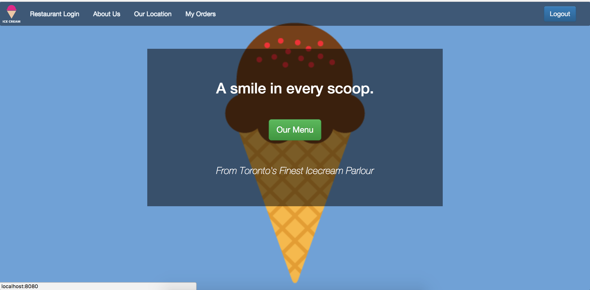
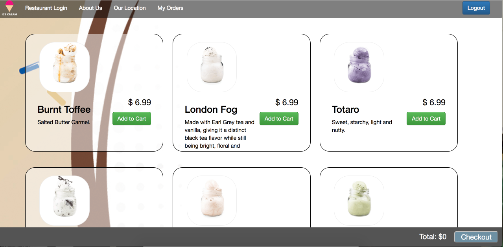
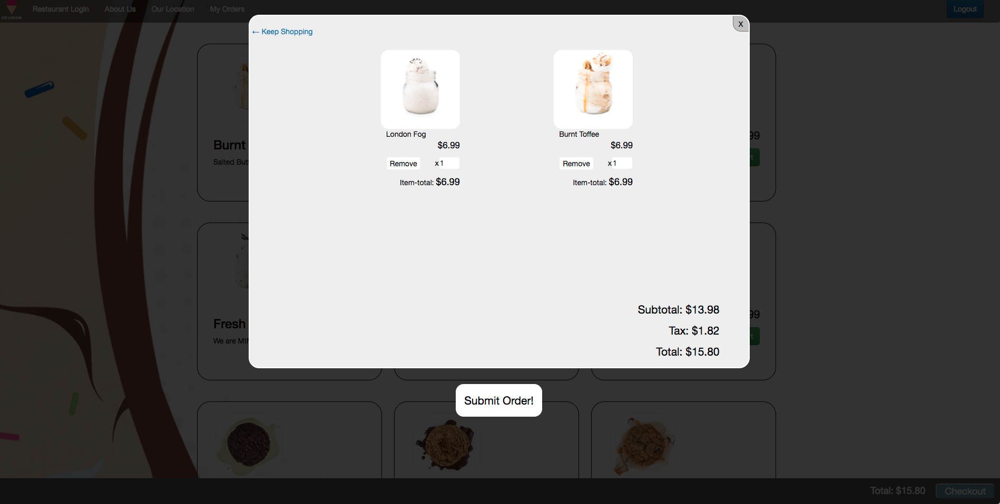
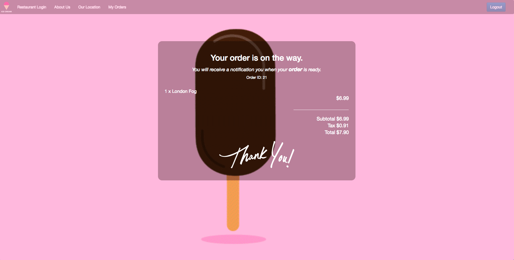
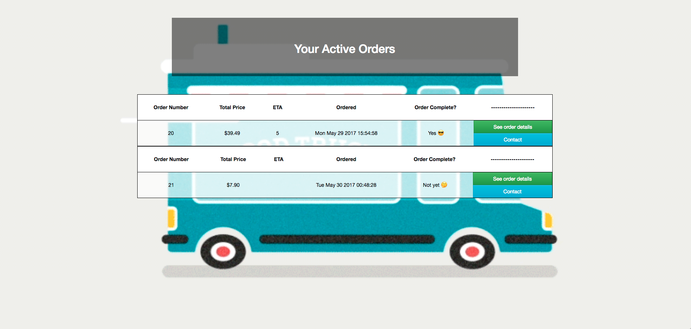
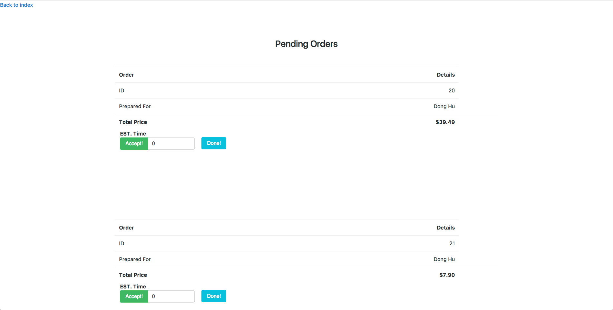

## Bon Appetit

A food pick-up ordering app built for an icecream parlor but scalable to include multiple restaurants as a midterm project at Lighthouse Labs with a team of 3. The app allows a customer(user) to place an order and a restaurant to notify the user the status of their order via a dynamic order status page and text message notification.

* Front-end built using Bootstrap, Javascript, and HTML/CSS
* Backend was built using Node.js, Express, and PostreSQL
* Twilio API (modern telecomm API service) was used to allow text message or audio communication between the customer and restaurant

## Team Members:
* Dong Hu
* Viktor Tymofeev
* Karunvir Singh

## Project Screenshots


```
Index Page for the user and restaurant to be able to login.
```



```
Menu.
```



```
Cart allowing users to edit their order (increase, decrease or remove items).
```



```
Order confirmation page is displayed to the user once "Submit Order!" button is pressed.
```



```
User's active order page. They are able to see their order's estimated time of arrival (ETA), if their order has been completed and their order's details.
```



```
Restaurant's active order page that allows the restaurant to update the ETA and order completion status. Once 'done' is pressed, the order is removed from the restaurant's order page.
```

## Getting Started

1. Create the `.env` by using `.env.example` as a reference: `cp .env.example .env`
2. Update the .env file with your correct local information
3. Install dependencies: `npm i`
4. Fix to binaries for sass: `npm rebuild node-sass`
5. Run migrations: `npm run knex migrate:latest`
  * Check the migrations folder to see what gets created in the DB
6. Run the seed: `npm run knex seed:run`
  * Check the seeds file to see what gets seeded in the DB
7. Run the server: `npm run local`
8. Visit `http://localhost:8080/`

## Dependencies

* Node 5.10.x or above
* NPM 3.8.x or above

## Improvements:
* Register Page for User
* User and restaurant authentication
* Responsive Design
